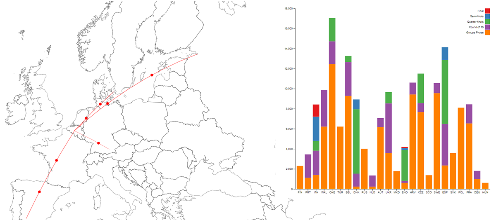

# V2D_unil

## Euro 2020 - A breakdown of distances traveled

This project attempts to provide an easily explored and easily understandable visualisation of the data as it pertains to the distances traveled by each during their participation in the 2020 UEFA European Championships. Exceptionnaly, this edition of the tournament was held in 11 cities across Europe, instead of the usual format, where the tournament is held in a single country. It is an attempt at illustrating some of the criticism by the media after the reveal of the very unequal travel plans. 

## Data collection

Data was collected manually and compiled into a csv format, based on [UEFA](https://www.uefa.com/uefaeuro-2020/fixtures-results/#/md/33673)'s website for the match locations, [base camp locations](https://www.uefa.com/uefaeuro-2020/news/0259-0e8ea1e12265-1c20a6816e6c-1000--euro-2020-team-bases/) as well as [Wikipedia](https://en.wikipedia.org/wiki/UEFA_Euro_2020) and the team's Twitter accounts for some of the group phase travel. The csv files can be easily modified through a simple text editor or through mechatroner's [Rainbow CSV](https://marketplace.visualstudio.com/items?itemName=mechatroner.rainbow-csv) extension for Visual Studio Code, enabling color highlighting and queries.

## Installation and usage

In order to acess the project, you must run it locally. This can be done simply through Ritwick Dey's [Live Server](https://marketplace.visualstudio.com/items?itemName=ritwickdey.LiveServer) extension for Visual Studio Code or through a locally run server using python.

### Python server

1. Download the project and extract into a folder
2. Navigate to the folder with command prompt or a terminal of your choice
3. Initiate server by entering `python -m http.server`
4. Your terminal will display the address and port at which the content is being displayed e.g: `Serving HTTP on 0.0.0.0 port 8000`
5. Use your browser to navigate to that address and start with index.html e.g `http://0.0.0.0:8000/index.html`

## Libraries and dependencies 
This visualisation project makes use of [d3.js](https://d3js.org/) in order to display stacked bar charts as well as generating maps, on top of which travel lines are plotted. 

## Author

Project developed by Fábio Cabral as a final project for the "Visualisation de données" class by Professor [Isaac Pante](https://github.com/ipante) at University of Lausanne during the Spring semester of 2020.

Credits: https://geojson-maps.ash.ms/ ; https://codepen.io/andrewhawkes/ ; https://codepen.io/hgomez ; https://codepen.io/ugoon ; https://observablehq.com/@mbostock ;

Country flags by <a href="https://www.freepik.com" title="Freepik">Freepik</a> from <a href="https://www.flaticon.com/fr/" title="Flaticon">www.flaticon.com</a>

